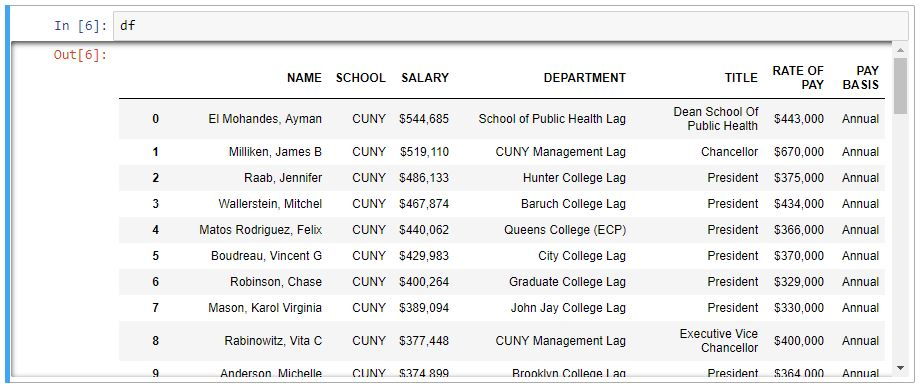

<hr />
## Project Description
This workshop is our first introduction to data visualization with Python. No programming background is required. In this first workshop you will learn to setup Python programming environment and all the related programming packages, and you will end with a fairly straight forward webscraping exercise to visualize the income level of the University of Virginia School of Architecture Faculty. By the end of this session, you will learn to do something like this.

<iframe width="1024" height="550" frameborder="0" scrolling="no" src="//plot.ly/~tngai/6.embed"></iframe>

***

# Step 1
### Python Installation

First you want to to install [Anaconda](https://www.anaconda.com/distribution/), and the current version as of writing is Python 3.7.

Once you have downloaded and installed Anaconda, open a [Terminal](https://www.macworld.co.uk/how-to/mac-software/how-use-terminal-on-mac-3608274/) if you're on OSX or [Anaconda Prompt](https://docs.anaconda.com/anaconda/user-guide/getting-started/) if you're on Windows.

You want to create a Virtual Environment for this exercise. The purpose of virtual environment is to create an isolated environment to contain all the packages you will install. Since python is used from machine learning to webscraping to data visualization, sometimes you will encounter an application such as GIS will require python version 2.7 and tensorflow will only work with python version 3.5. So virtual environment is a very convenient way to manage your python installations.

To create a virtual environment in [Anaconda](https://www.anaconda.com/distribution/), in the [Terminal](https://www.macworld.co.uk/how-to/mac-software/how-use-terminal-on-mac-3608274/) or [Anaconda Prompt](https://docs.anaconda.com/anaconda/user-guide/getting-started/), type:
<pre><code>conda create -n dataviz python=3.6</code></pre>

{:height="50%" width="50%"}

When asked to proceed, click Y and press Enter. If you have trouble creating an environment in Anaconda, please refer to this [page](https://conda.io/projects/conda/en/latest/user-guide/tasks/manage-environments.html)

Now that you have Python running in your system, you want to activate the environment you just created and then start installing all the packages that we will use to complete this workshop. First activate the environment by typing this in the Terminal or Anaconda Prompt.

<pre><code>conda activate dataviz</code></pre>

If you're successful in activating the virtual environment, you should see the name of the enviroment appear in brackets.

{:height="50%" width="50%"}

***


# Step 2
### Jupyter Notebook Installation
Next we need to install [Jupyter Notebook](https://jupyter.org/index.html) by typing the following command in Terminal or Anaconda Prompt, and type Y when asked to Proceed.

<pre><code>conda install jupyter</code></pre>

{:height="50%" width="50%"}

Jupyte Notebook is an Interactive Computing Environment that allows your to get immediate feedback when coding, thereby making programming much more visual and intuitive.

### Installing Other Python Packages
Next we install [Plotly](https://plot.ly/python/getting-started/), [Numpy](https://pypi.org/project/numpy/), [Beautifulsoup](https://pypi.org/project/beautifulsoup4/), and [Pandas](https://pandas.pydata.org/pandas-docs/stable/install.html) by typing the following command in Terminal or Anaconda Prompt.

<pre><code>pip install plotly numpy beautifulsoup4 pandas</code></pre>

[Plotly](https://plot.ly/python/getting-started/) is a dynamic graphing web application, [Numpy](https://pypi.org/project/numpy/) is a processor that deal with multidimensional arrays or matrices, [Beautifulsoup](https://pypi.org/project/beautifulsoup4/) is a webscraping module, and [Pandas](https://pandas.pydata.org/pandas-docs/stable/install.html) is a library for data processing.

<hr />

# Step 3
### Launch Jupyter Notebook
Next, we first create a folder where all the coding files will reside. In my case I'll create a folder on my desktop call dataviz. You can do that however you want. Once the folder has been created, go back to your Terminal or Anaconda Prompt, then type cd and then the path to your newly created folder. *If you don't like typing the full path of your folder by hand, follow this tip.

<ul class="actions">
	<li><a href="https://searchenterprisedesktop.techtarget.com/photostory/2240216625/Ten-hidden-Windows-command-prompt-tricks/11/Drag-and-drop-a-folder-to-open-command-prompt" target="_blank" class="button">Tip Windows</a></li>
    <li><a href="http://osxdaily.com/2009/11/23/copy-a-files-path-to-the-terminal-by-dragging-and-dropping/" target="_blank" class="button">Tip OSX</a></li>
</ul>

<pre><code>cd /Users/tedngai/Desktop/dataviz</code></pre>

{:height="50%" width="50%"}

Once you're in your newly created folder, copy download these 2 data file and place them into your folder, and then you can launch Jupyter Notebook by typing the following. Your web browser should open the web app, and Jupyter should now show your current location. 

<ul class="actions">
	<li><a href="../../../assets/files/SalaryScrape.zip" class="button">Download Data File</a></li>
</ul>

<pre><code>jupyter notebook</code></pre>

{:height="50%" width="50%"}

Last but not least, click the New button at the near top right and click on Python 3 to create a new notebook. And congratulations, if you are able to get to this point, you are all set to do some exciting programming. If you have trouble getting things to work thus far, please carefully review the steps and make sure you have your virtual environment activated and you are in a proper folder. If you continue to have problem, please feel free to contact us via Slack or email.

{:height="50%" width="50%"}

***


# Step 4
### Webscraping & Dataprocessing
Webscraping is a very powerful tool for data visualization especially if you're interested in culturo-socio-polico-economic issues. This tool allows you to tap into vast amount of data from sometimes not so data friendly sources. In this example, we will look at salay levels of people who work in the New York Public Education System. By deploying the Freedom of Information Act, many organizations have requested and released data such as salary levels of all public employees across the country. This is an invaluable tool to demand accountability for people holding public offices. However, these dataset do not always come in a format that is ready to be visualized. In our case, we will use the data released by the [Empire Center](https://www.seethroughny.net/) looking at salary levels of employees working in the CUNY system.

To start, the data cannot be downloaded with the click of a button. So we'll need to do some detective work and see how we can collect the information we want. Make sure you have [seethroughny.net](https://www.seethroughny.net/) opened. Go to Menu > Payrolls > Schools, then under Filter > Employer / Agency, type in Fashion Institute of Technology. You can click the following button to see this data on their website, the actual data file is provided for you earlier as well.

<ul class="actions">
	<li><a href="https://www.seethroughny.net/payrolls/107209525" target="_blank" class="button">FIT Payroll</a></li>
</ul>

We will cover how to use python to access web pages and webscrape with code at a different exercise. For now, I have already prepared and downloaded part of the html data for you so we can jump into data processing and visualization immediately.

p>Now let's go back to Jupyter Notebook, and in the first line, type in the following, and then Hit SHIFT + ENTER to execute the code.

<pre><code>from bs4 import BeautifulSoup
import pandas as pd
import codecs</code></pre>

{:height="50%" width="50%"}

Python is a very powerful programming language due to the fact that it has a large community of developers writing libraries to handle lower level programming, allowing you to concentrate on the big ideas.

There're many libraries and packages out there that will handle different types of programming issues. For us, the first step is to install the packages as we did earlier using pip install. And these few lines of code is to tell python that these packages are already installed and we need to deploy them into the current system.

Next we need to load the data file. Do that by typing the following and the **Hit SHIFT + ENTER** again to execute the code.

<pre><code>f = codecs.open("./FIT_salaryscrape.txt", "r")

data = []

soup = BeautifulSoup(f.read())
rows = soup.find_all('tr')
for row in rows[::2]:
    cols = row.find_all('td')
    cols = [ele.text.strip() for ele in cols]
    data.append([ele for ele in cols[1:] if ele])</code></pre>

{:height="50%" width="50%"}

The first line of code here is to read the text file into the variable **f**. The second line is to create an **Empty Array** named data. Think of it as a bucket that will hold the data that will come in, and this is just to prepare for it. Third line is to call on BeautifulSoup to read the text file. BeautifulSoup is made to parse html files, and the text file we just loaded is really just html that has been copied and pasted to contain only the data portion. By using BeautifulSoup we can process the data much quicker without having to write low level code ourselves. At this point, the variable **soup** should contain the whole text files. Try typing in **soup** in the next time and execute it, you should see the HTML content.

{:height="50%" width="50%"}

If you're not familiar with HTML, it's basically a big mix of human readable language mixed with machine language, allowing for both human and machine to access the same set of information, therefore creating a convergence. Most of the machine language is contained within this <> bracket call **Tags**. There're lots of common tags, and the one that we see here is **TR** and **TD**. **TR** represents **Table / Row**, and **TD** represents **Table / Data cell**. Each row of data begins with the tag **TR** and end with this tag **/TR**. And as we can see here, there're a bunch of **TD** tags within the **TR** tags. So if we look at the python code, BeautifulSoup is used to read the whole HTML text file, and then the function **final_all** is used to locate all the **TR** tags and they're collected in a variable all **ROWS**.

This following bit of code is about applyoing a programming logic to go through each row of data and apply the same procedure, and we therefore end up with a programming friendly dataset. **for row in rows** is a simple way that python goes that every single item in a big list of things. A list is a variable that contains many items, and we created a list of data that contains each row of data from the file earlier. So this function essentially allow us to go through each row of data one by one.

Now that we're inside the for loop, equivalent to plowing through each row of data, we'll identify all the **TD** tags and then sort them into another list of items with the **find_all** function.

The next line uses the **text.strip()** function to get rid of all the machine language or tags so all that remains is human language. Last but not least, the last line puts each row of data that has been processed into a variable that I called a bucket earlier. You can see what the variable data looks like if you just execute the variable data. Type data and **Hit SHIFT + ENTER** 

{:height="50%" width="50%"}

As you can see, the data structure is called a list of lists. It's a list of Names, School Affiliation, Salary Level, and NYSTRS Description, of a list of all 377 people. Now it's time to turn this list of lists into a Pandas dataframe to make visualization much easier. Think of Pandas as a very powerful Excel that can handle lists and tables very well. To do this we need to just give the data a **HEADER**, and then call a function to create a new variable. Execute the following code and the type **df** to see what's inside the **df** variable.

<pre><code>labels = ['NAME', 'SCHOOL', 'SALARY', 'TYPE']
df = pd.DataFrame.from_records(data, columns=labels)</code></pre>

{:height="50%" width="50%"}

Now that you have turned an ordinary list of lists into a Pandas Dataframe, we will be able to use many of its power features to further process the data. And we will return to this shortly after we've moved onto the last part, which is data visualization.

***

# Step 5
### Data Visualizaiton
Finally we're ready to visualize the data. As you can see, the table only has 4 columns of data and 2 of which are identical. So essentially, we only have **names** and **salary** to work with. So essentially we can do a [Box Plot](https://plot.ly/python/box-plots/) that allow us to look at a 1-Dimensional data in an interesting way.

For this next part we'll need to bring in some other python packages. Plotly is a dyamic graphing package that lets you interact with data live. We will look at the very basics of how to use it to graph the data we have. So first import the necessary packages by typing in the following.

<pre><code>import plotly.plotly as py
import plotly.graph_objs as go
from plotly.offline import download_plotlyjs, init_notebook_mode, iplot

init_notebook_mode(connected = True)</code></pre>

The first 3 lines of code is just to import the Plotly graphing packages. The 4th one is to allow plotly to plot directly inside Jupyter. Once you have executed the code to import all the plotly packages, you can go ahead and input the following code.

<pre><code>trace0 = go.Box(
        name = "FIT",
        y = df['SALARY'])

layout = go.Layout(
        title = "FIT Faculty Salary")

data = [trace0]
iplot({"data":data,
       "layout":layout})</code></pre>

If everything is running correctly, you should see a graph like this one. This is a 1 dimensional graph that gives you a bit of statistical calculation. It tells you what the median value is, what the lower and upper fence is, and what numbers are falling outside of the norm. How going back to the code, **trace0** is defined to use Box graph and you assign the Y axis to only the **SALARY** column of the dataframe. For layout, we're naming the graph FIT Faculty Salary. Data is needed to put trace0 in a square bracket. This step is necessary because if we want to plot more than 1 column of data, we can put multiple values here. Lastly, the iplot command sends the plot to jupyter.

<iframe width="400" height="500" frameborder="0" scrolling="no" src="//plot.ly/~tngai/78.embed"></iframe>

You can download the jupyter file here and review the all the inputs here.

<ul class="actions">
	<li><a href="../../../assets/files/FIT_bs4.ipynb" class="button">Download Jupyter File</a></li>
</ul>

# Step 6
###Data Visualizaiton Challenge
Let's try to apply everything we've learn so far and apply it to a more challenging dataset. For this part, you will have to learn a few more Pandas commands on data processing. And for this task, we will use the **CUNY_salaryscrape.txt** file that was downloaded earlier. Or here's the link again.

<ul class="actions">
	<li><a href="../../../assets/files/SalaryScrape.zip" class="button">Download Data File</a></li>
</ul>

Now before we begin this final challenge, let's take a look at the file and try to understand what kind of strategy we need to unpack this. First, the text file itself is almost 50Mb, for a text file this is pretty big, which means we have to be a careful about memory management. And upon opening the file, you'll find that there're over 12 million lines of text inside. Although not all the lines are useful data, we'll need to devise a way to extract only the useful information out.

Now let's open up the file and look at the first 2 rows of data and try to see what we're dealing with. The file opens with an html tag `<tbody>` followed by 1 `<tr>` tag and a bunch of `<td>` tags. This part of the file is exactly the same as the previous exercie. However, this dataset differs in that the `<tr>` tags have 2 different `id` types: 1 is the ***resultRow*** and the other is the ***expandRow***, with ***resultRow*** showing the basic information and ***expandRow*** showing supplemental information. This means the rows of data alternate and we have to accomodate that with our code. 

Also, the first row of data is separated into columns with the `<td>` tags whereas the second row is tag is separated `<div>` tags. So the 2 rows of data will have to be parsed differently.

```
<tbody><tr id="resultRow88275159" onclick="stnyResultTable.toggleRow(88275159); return false;">
    <td><a href="#"><i class="glyphicon glyphicon-minus"></i></a></td>
    <td>El Mohandes, Ayman</td>
    <td>CUNY</td>
    <td>$544,685</td>
    <td class="visible-sm visible-md visible-lg">School of Public Health Lag</td>
        </tr>
	<tr id="expandRow88275159" style="">
    <td>&nbsp;</td>
    <td colspan="5">
        <div class="row visible-xs-block">
            <div class="col-xs-4"><strong>SubAgency/Type</strong></div>
            <div class="col-xs-6">School of Public Health Lag</div>
        </div>
        <div class="row">
            <div class="col-xs-4"><strong>Title</strong></div>
            <div class="col-xs-6">Dean School Of Public Health</div>
        </div>
        <div class="row">
            <div class="col-xs-4"><strong>Rate of Pay</strong></div>
            <div class="col-xs-6">$443,000</div>
        </div>
        <div class="row">
            <div class="col-xs-4"><strong>Pay Year</strong></div>
            <div class="col-xs-6">2018</div>
        </div>
        <div class="row">
            <div class="col-xs-4"><strong>Pay Basis</strong></div>
            <div class="col-xs-6">Annual</div>
        </div>
        <div class="row">
            <div class="col-xs-4"><strong>Branch/Major Category</strong></div>
            <div class="col-xs-6">State - Executive</div>
        </div>
            </td>
```

Ok so let's just right into this. First, again, import all the packages we need by executing the following code. 

<pre><code>from bs4 import BeautifulSoup
import urllib3
import pandas as pd
import numpy as np
from collections import defaultdict
import plotly.plotly as py
import plotly.graph_objs as go
from plotly.offline import download_plotlyjs, init_notebook_mode, iplot
import codecs

init_notebook_mode(connected = True)</code></pre>

Next, read the data file and use BeautifulSoup to sort all the rows of data into a list of lists.

<pre><code>f = codecs.open("./CUNY_salaryscrape.txt", "r")
soup = BeautifulSoup(f.read())
rows = soup.find_all('tr')</code></pre>

Same as before, the following code is to go through each row of data and extract all the `<td>` tags and put them in the right place. However, as mentioned before, the data is structured differently this time, so all the extra code here is to deal with the alternating rows and the different data tags used. 

Not to get too much into the technical detail, but the idea is to use 2 buckets, 1 to hold data for very 2 rows of data, which will then be dumped into the other bucket, and then empty itself out. So this is a way to get around the quirkiness data structure that was provided.

<pre><code>data = []
temp = []
i = 0

def flatten(temp):
    return [item for sublist in temp for item in sublist]

for row in rows:
    cols = row.find_all('td')
    cols = [ele.text.strip() for ele in cols]
    temp.append(cols[1:])
    i += 1
    if i%2 == 0:
        templist= temp[1][0].split('\n')
        temp[1]=templist
        flattemp = flatten(temp)
        data.append([ele for ele in flattemp if ele])
        temp = []</code></pre>

How that we have a list of lists with all the useful data in it, it's time to turn them into a Pandas dataframe for further processing. 

<pre><code>labels = ['NAME', 'SCHOOL', 'SALARY', 'DEPARTMENT', 'SUBAGENCY TYPE','SUBAGENCY','TITLE TYPE','TITLE','RATEOFPAY TYPE', 'RATE OF PAY','PAYYEAR TYPE', 'PAY YEAR', 'PAYBASIS TYPE', 'PAY BASIS','BRANCH TYPE', 'BRANCH']

df = pd.DataFrame.from_records(data, columns=labels)</code></pre>

Since the 2nd row of data contains a lot of "junk" data we will need to eliminate some of the columns of data that was just created. We're doing it this way instead of parsing it out during the input phase because it's a lot easier to remove columns with Pandas than to use logic to filter out unwanted data. 

<pre><code> df = df.drop(['SUBAGENCY TYPE','TITLE TYPE', 'RATEOFPAY TYPE','SUBAGENCY', 'PAYYEAR TYPE', 'PAY YEAR','PAYBASIS TYPE', 'BRANCH TYPE','BRANCH'],axis=1) </code></pre>

If everything is going smoothly up to this point, you should see something like this when you type in `df`

{:height="50%" width="50%"}
